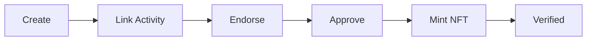

# FairCredit (Doc Work in Progress)

**An Open Academic Credentialing Protocol on Solana**

FairCredit is a blockchain-based platform that revolutionizes verification of non-traditional academic achievements. Built on Solana, it enables educational providers to issue cryptographically-verified academic credentials as NFTs, transforming intangible achievements into immutable, instantly verifiable digital records.

---

## 🎯 Vision

Transform academic credentialing by providing:

- **Instant Verification**: One-click verification of academic achievements
- **Immutable Records**: Blockchain-backed credentials that can't be forged
- **Open Access**: Anyone can become a provider; trust is decentralized
- **Academic Integrity**: Supervisor endorsements create verifiable chains of trust

---

## 🏗️ Architecture

### Smart Contract (Solana/Anchor)

The FairCredit protocol is implemented as a Solana program written in Rust using the Anchor framework:

**Program ID**: `95asCfd7nbJN5i6REuiuLHj7Wb6DqqAKrhG1tRJ7Dthx`

#### Core Components

- **Hub**: Curated registry maintaining accepted providers and courses (optional quality control layer)
- **Providers**: Educational institutions that create courses and manage credentials
- **Courses**: Educational programs containing resources, modules, and student enrollments
- **Credentials**: Blockchain-backed academic achievements linked to courses, endorsed by supervisors
- **Resources**: Learning materials (lessons, assignments, projects) with Nostr and Walrus storage integration
- **Submissions**: Student work submitted for grading, stored on-chain with asset references

#### Key Features

- **Decentralized Course Management**: Providers create and manage courses with modular content
- **Credential Workflow**: Create → Endorse → Approve → Mint NFT
- **Academic Endorsements**: Supervisor signatures create cryptographic proof of mentorship
- **Hub Filtering**: Optional curated registry for quality assurance
- **NFT Credentials**: Metaplex-compatible NFTs for wallet/marketplace integration
- **Multi-Storage**: Nostr protocol integration and Walrus decentralized storage support

### Frontend (Next.js)

Modern React-based web application providing:

- **Wallet Integration**: Phantom, Solflare, and other Solana wallets
- **Course Discovery**: Browse and explore available courses
- **Credential Management**: Create, track, and verify credentials
- **Provider Dashboard**: Course creation and student management
- **Public Verification**: Shareable verification pages for credentials
- **Supervisor Endorsement**: Email-based workflow for academic supervisor approval

**Tech Stack**:

- Next.js 16 with React 19
- Solana Web3.js for blockchain interaction
- TailwindCSS + Radix UI for modern, accessible components
- Reown AppKit for wallet connectivity
- Nostr Tools for decentralized content references

---

## 🚀 Getting Started

### Prerequisites

- **Node.js** 18+ and npm/pnpm
- **Solana CLI** 1.18+
- **Anchor** 0.31+
- **Rust** 1.75+

### Installation

```bash
# Clone the repository
git clone https://github.com/yourusername/FairCredit.git
cd FairCredit

# Install dependencies
npm install
cd app && npm install && cd ..
```

### Local Development

#### 1. Start Solana Test Validator

```bash
npm run validator
```

This starts a local Solana validator with Metaplex program cloned for NFT functionality.

#### 2. Deploy Smart Contract

```bash
# Build and deploy the program
cd anchor && anchor build && anchor deploy && cd ..

# Generate TypeScript client
npm run gen:client

# Run deployment scripts
npm run deploy
```

#### 3. Start the Frontend

```bash
npm run dev
```

Access the application at: `http://localhost:8888`

### Testing

```bash
# Run all tests
npm run test

# Anchor smart contract tests
npm run test:anchor

# Frontend integration tests
npm run test:app

# Quick program tests
npm run test:program
```

---

## 📖 User Flows

### Provider: Creating a Course

1. **Connect Wallet** and register as a provider
2. **Create Course** with name, description, and workload requirements
3. **Add Modules** with resources (lessons, assignments)
4. **Submit for Hub Approval** (if using curated registry)
5. **Publish Course** once approved

### Student: Earning a Credential

1. **Browse Courses** and select a program
2. **Complete Course Work** by engaging with resources and submitting assignments
3. **Create Credential** linked to the completed course
4. **Request Endorsement** from academic supervisor
5. **Await Provider Approval** to finalize credential
6. **Receive NFT** minted to your wallet

### Supervisor: Endorsing a Credential

1. **Receive Email Link** from student
2. **Review Credential Details** and student work
3. **Connect Wallet** and provide cryptographic signature
4. **Endorsement Recorded** on-chain

### Verifier: Checking Credentials

1. **Receive Verification Link** from credential holder
2. **View Credential Details** including course, provider, and endorsements
3. **One-Click Verification** to check blockchain proof
4. **Explore on Solana Explorer** for full transparency

---

## 🔑 Key Concepts

### Hub-Based Curation

The **Hub** is an optional curated registry that maintains quality standards:

- **Accepted Providers**: Vetted educational institutions
- **Accepted Courses**: Approved educational programs
- **Course Lists**: Organized collections for discovery

Providers can operate independently, but Hub acceptance signals quality assurance.

### Credential Lifecycle



1. **Create**: Student initiates credential for a course
2. **Link Activity**: Associate completed work and resources
3. **Endorse**: Academic supervisor provides cryptographic signature
4. **Approve**: Provider confirms credential quality
5. **Mint NFT**: Credential becomes tradeable NFT
6. **Verified**: Publicly verifiable on the blockchain

### Decentralized Storage

FairCredit supports multiple storage backends:

- **Nostr**: Decentralized social protocol for content references
- **Walrus**: Decentralized storage network for large files
- **On-chain**: Critical metadata stored directly on Solana

---

## 🛠️ Project Structure

```
FairCredit/
├── anchor/                 # Solana smart contract
│   └── programs/
│       └── fair-credit/    # Main program code
│           ├── src/
│           │   ├── lib.rs              # Program entry point
│           │   ├── state/              # Account structures
│           │   ├── handlers/           # Instruction handlers
│           │   ├── types/              # Custom types
│           │   └── events.rs           # On-chain events
│           └── Cargo.toml
├── app/                    # Next.js frontend
│   ├── app/                # App router pages
│   ├── components/         # React components
│   ├── lib/
│   │   └── solana/        # Solana integration
│   │       ├── generated/  # Auto-generated from IDL
│   │       └── config.ts   # Network configuration
│   ├── hooks/             # React hooks
│   └── tests/             # Playwright tests
├── scripts/               # Deployment and utility scripts
│   ├── deploy/            # Deployment automation
│   └── utils/             # Helper functions
├── docs/                  # Documentation
├── FairCredit_PRD.txt    # Product Requirements
└── DEPLOYMENT.md         # Deployment guide
```

---

## 🧪 Development Workflow

### Building the Smart Contract

```bash
# In anchor/ directory
anchor build

# Generate TypeScript client from IDL
npm run gen:client
```

The TypeScript client is auto-generated using [Codama](https://github.com/codama-idl/codama) from the Anchor IDL.

### Frontend Development

```bash
cd app
npm run dev
```

The frontend automatically copies the latest IDL before building (`predev` script).

### Adding New Features

1. **Update Smart Contract** in `anchor/programs/fair-credit/src/`
2. **Rebuild Program** with `anchor build`
3. **Regenerate Client** with `npm run gen:client`
4. **Update Frontend** in `app/` using new types and instructions
5. **Write Tests** in `app/tests/` and `anchor/tests/`

---

## 🌐 Deployment

### Development (Localnet)

See [DEPLOYMENT.md](./DEPLOYMENT.md) for detailed local setup.

### Staging/Production

1. **Build optimized program**:

   ```bash
   cd anchor && anchor build --verifiable
   ```

2. **Deploy to devnet/mainnet**:

   ```bash
   anchor deploy --provider.cluster devnet
   ```

3. **Update program ID** in:

   - `anchor/programs/fair-credit/src/lib.rs` (declare_id!)
   - `app/lib/solana/config.ts`

4. **Deploy frontend** (configured for Netlify):
   ```bash
   cd app && npm run build
   netlify deploy --prod
   ```

---

## 📊 Current Status

### ✅ Completed Features

- **Smart Contract Core**: All major instructions implemented

  - Provider registration and management
  - Course creation with modules and resources
  - Credential workflow (create, endorse, approve, mint)
  - Hub-based curation system
  - Submission and grading system
  - Nostr and Walrus storage integration

- **Frontend Foundation**:

  - Wallet connectivity with multiple providers
  - Course browsing and discovery
  - Credential creation and management
  - Provider dashboard
  - Supervisor endorsement workflow
  - Public verification pages

- **Infrastructure**:
  - Automated deployment scripts
  - TypeScript client generation from IDL
  - Comprehensive test suite
  - Local development environment

### 🚧 In Progress

- **NFT Minting**: Metaplex integration for credential NFTs
- **Enhanced UI/UX**: Polish and mobile responsiveness
- **Analytics**: Usage tracking and metrics
- **Search**: Advanced course and credential discovery

### 📋 Roadmap

See [FairCredit_PRD.txt](./FairCredit_PRD.txt) for the full product roadmap, including:

- Phase 1: MVP Foundation (mostly complete)
- Phase 2: Enhanced User Experience
- Phase 3: Platform Expansion
- Phase 4: Ecosystem Extension

---

## 🤝 Contributing

Contributions are welcome! Please:

1. Fork the repository
2. Create a feature branch (`git checkout -b feature/amazing-feature`)
3. Commit your changes (`git commit -m 'Add amazing feature'`)
4. Push to the branch (`git push origin feature/amazing-feature`)
5. Open a Pull Request

### Development Guidelines

- Follow Rust conventions for smart contract code
- Use TypeScript strict mode for frontend
- Write tests for new features
- Update documentation as needed

---

## 📄 License

ISC License - see package.json for details

---

## 🔗 Resources

- **Solana**: https://solana.com
- **Anchor Framework**: https://anchor-lang.com
- **Next.js**: https://nextjs.org
- **Metaplex**: https://metaplex.com
- **Nostr**: https://nostr.com
- **Walrus**: https://walrus.site

---

## 📄 Documentation

- [Product Requirements Document](./FairCredit_PRD.txt) - Complete product vision and roadmap
- [Deployment Guide](./DEPLOYMENT.md) - Deployment procedures and configuration
- [Implementation Logs](./docs/logs/) - Development progress logs (dated archives)
- [Course-Credential NFT Plan](./docs/PLAN-course-credential-nft.md) - NFT integration architecture
- [Content Storage Architecture](./docs/content-storage-architecture.md) - Multi-storage backend design
- [Testing Guide](./app/TESTING.md) - Testing procedures and best practices

---

## 📧 Contact

For questions or support, please open an issue on GitHub.

---

_Building the future of academic credentialing, one block at a time._ 🎓⛓️

```

```
