# Dev Logs — Writing Guide

This directory contains dated implementation logs tracking FairCredit's development. Each log is a self-contained record of what changed in a session, where the project stands, and what comes next.

## Naming Convention

```
YYYY-MM-DD_IMPLEMENTATION_LOG.md
```

## Structure & Rules

Every implementation log **must** follow this structure. Use `2026-02-10_IMPLEMENTATION_LOG.md` as the canonical reference.

---

### 1. Header

```markdown
# FairCredit Implementation Log — YYYY-MM-DD

**Project**: FairCredit - Open Academic Credentialing Protocol
**Current Phase**: [brief phase name]
**Last Updated**: [date]
```

---

### 2. Latest Commit (Required)

Start with the **latest commit** details in a code block, followed by a table listing all commits since the previous log.

```markdown
## 📌 Latest Commit

\`\`\`
Commit: [full hash]
Date: [date]
Author: [name] <[email]>
Message: [commit message]
\`\`\`

**Commits since last log** (`[prev_hash]..HEAD`):

| Commit    | Message   |
| --------- | --------- |
| `abc1234` | feat: ... |

**Files changed**: N files, +X / −Y lines
```

Use `git log --oneline [prev]..HEAD` and `git diff --stat [prev]..HEAD` to generate this.

---

### 3. Changes Made Today (Required)

List every meaningful change with a numbered heading. For each:

- **What** changed (be specific)
- **Which files** were affected (use a table for multi-file changes)
- **Why** if not obvious (root cause for bug fixes)

Example format:

```markdown
## 🔨 Changes Made Today

### 1. [Feature/Fix Name]

[1-2 sentence description]

| File              | Change                        |
| ----------------- | ----------------------------- |
| `path/to/file.rs` | Added `method_name()` for ... |

### 2. [Bug Fix Name]

- **Root cause**: [explanation]
- **Fix**: [what was done]

**File**: `path/to/file.tsx`
```

**Rules**:

- Group related changes (e.g., contract + frontend for same feature)
- Be specific about function names, file paths, and behavior
- For bug fixes, always document the root cause

---

### 4. Project Status Assessment (Required)

Provide an **honest** assessment. Do not overstate completion.

- Use a table with Status column: ✅ Working, 🚧 Contract ready / frontend TBD, 📋 Not started
- Clearly separate "what works end-to-end" from "what has contract code but no UI"
- Include a **workflow diagram** showing the current position:

```markdown
### Workflow Progress

Hub Setup ✅ → Provider Registration ✅ → Course Creation ✅
↓
Student Creates Credential 🚧 ← WE ARE HERE
↓
Mint NFT 📋
```

**Rules**:

- If a feature is "contract ready but frontend not wired", say so — don't mark it ✅
- If something was overstated in a previous log, **explicitly correct it** with a blockquote

---

### 5. Next Steps (Required)

Organized by time horizon. Each item has checkboxes for tracking.

```markdown
## 🎯 Next Steps (Revised)

### Immediate

1. **[Goal]**
   - [ ] Sub-task A
   - [ ] Sub-task B

### Short Term

...

### Medium Term

...
```

**Rules**:

- Be realistic — don't list NFT minting as "immediate" if Credential flow isn't done
- Order by dependency: items that block other items come first
- Mark items as `(Revised)` if priorities changed from previous log

---

### 6. Change Log (Required)

Concise bullet list of today's changes, plus a summary of the previous day.

```markdown
## 📝 Change Log

### YYYY-MM-DD

- Change 1
- Change 2
- **Corrected**: [note any status corrections from previous log]

### YYYY-MM-DD (previous)

- Summary of previous session
```

---

### 7. Footer

Link to the previous log:

```markdown
_This log continues from [YYYY-MM-DD_IMPLEMENTATION_LOG.md](./YYYY-MM-DD_IMPLEMENTATION_LOG.md)._
```

---

## Rendering Environment

These logs are rendered in **Nextra** (MDX). Take advantage of the following rich display modules:

### Mermaid Diagrams

Use Mermaid for workflow diagrams, architecture overviews, and state machines instead of ASCII art:

````markdown

```mermaid
graph LR
    A[Hub Setup ✅] --> B[Provider Reg ✅]
    B --> C[Course Creation ✅]
    C --> D[Module Management ✅]
    D --> E[Submit for Review ✅]
    E --> F[Student Credential 🚧]
    F --> G[Endorsement 🚧]
    G --> H[Mint NFT 📋]
    style F stroke:#f59e0b,stroke-width:2px
```

````

### Callouts

Use Nextra callout syntax for important notes:

```markdown
> **⚠️ Correction from previous log**: The status of NFT minting was overstated...

> **💡 Design decision**: We chose optimistic delete because...
```

### Other Available Features

- **Tables** — use standard Markdown tables (fully supported)
- **Code blocks** — syntax highlighting for all major languages
- **Inline code** — for file paths, function names, commit hashes
- **Collapsible sections** — `<details>` / `<summary>` for verbose debug info

**Prefer Mermaid over ASCII art** whenever showing workflows, state transitions, or architecture.

---

## Do's and Don'ts

| ✅ Do                                      | ❌ Don't                                       |
| ------------------------------------------ | ---------------------------------------------- |
| Start with latest commit hash and stats    | Skip the commit section                        |
| Be honest about what's working vs. planned | Mark features ✅ if only the contract exists   |
| Document root causes of bug fixes          | Just say "fixed a bug"                         |
| Include file paths for every change        | Leave changes vague                            |
| Use the workflow diagram to show progress  | Claim the project is almost done when it isn't |
| Correct previous log's mistakes explicitly | Silently change status assessments             |
| Keep each log self-contained               | Assume reader has read previous logs           |

## Latest Log

The most recent log in this directory reflects the current project state.
